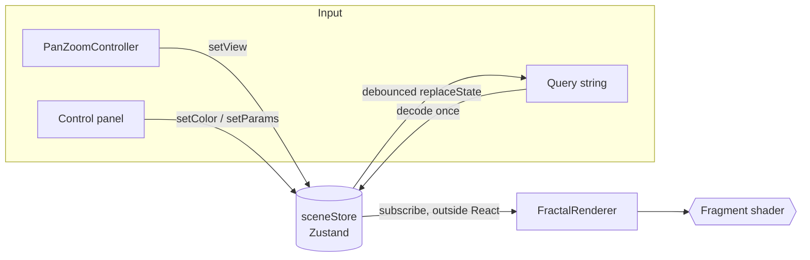

# Fractal Atlas

A real-time, GPU-rendered fractal explorer. Every pixel is computed in a GLSL
fragment shader, so zooming and panning stay fluid down to **10¹³× magnification**,
far past the point where 32-bit floats fall apart.

- **Buttery navigation**: the zoom stays anchored to the cursor with exponential easing, the pan coasts with inertia, and pinch works on touch devices.
- **Mandelbrot and Julia sets**, linked both ways: open the Julia set for any point of the Mandelbrot plane, or locate a Julia constant on the Mandelbrot set.
- **Live Julia parameter**: drag *c* across a rendered Mandelbrot map, or let it orbit to animate the set.
- **Deep zoom** using emulated double precision (df64) on the GPU, hardened against driver fast-math.
- **Progressive rendering**: the image sharpens over successive frames with 24× supersampling once the view settles.
- **Print-quality export**: tiled offscreen rendering up to 8K / 16k px, with a progress bar and cancel support.
- **Shareable links**: the entire scene lives in the URL.
- **Presets**: saved to `localStorage` with rendered thumbnails.

> **Status**: Phases 1–2 (Mandelbrot, Julia) are complete. L-systems and IFS are next (see [Roadmap](#roadmap)).

---

## Quick start

```bash
npm install
npm run dev        # http://localhost:5173
```

| Script              | What it does                                     |
| ------------------- | ------------------------------------------------ |
| `npm run dev`       | Vite dev server with HMR (shaders included)      |
| `npm run build`     | Type-check, then production build to `dist/`     |
| `npm run preview`   | Serve the production build                       |
| `npm test`          | Unit tests (Vitest)                              |
| `npm run lint`      | ESLint (typescript-eslint + react-hooks)         |

Requires a browser with **WebGL2** (every current desktop and mobile browser).

### Controls

| Input                        | Action                         |
| ---------------------------- | ------------------------------ |
| Scroll / trackpad pinch      | Zoom at cursor                 |
| Drag                         | Pan (release to coast)         |
| Double-click (⇧ to reverse)  | Dive ×4 at a point             |
| Two-finger pinch             | Zoom + pan on touch            |
| `+` / `−`                    | Zoom at centre                 |
| `R`                          | Reset view                     |
| `E`                          | Export PNG                     |
| `H`                          | Hide the interface (for recording) |

---

## Architecture

```
src/
├── app/            App shell, ViewportContext (imperative renderer/controller handles)
├── components/
│   ├── canvas/     FractalCanvas: mounts WebGL, wires store → renderer
│   ├── controls/   Reusable primitives: Slider, Toggle, SegmentedControl, ColorPicker, PalettePicker…
│   ├── panels/     ControlPanel, ParametersTab, PresetsTab, ExportDialog
│   └── hud/        Placard, Readout, Hint, Toast
├── fractals/       Domain: typed params, a registry, one module per fractal
│   ├── mandelbrot/ Mandelbrot definition
│   ├── julia/      Julia definition (binds the constant c)
│   ├── iterations.ts  shared depth-scaled iteration policy
│   └── curated.ts  curated views per fractal
├── gl/             Framework-free WebGL2 layer
│   ├── FractalRenderer.ts   frame loop, accumulation, tiled export
│   ├── ShaderProgram.ts     compile/link with line-numbered errors, cached uniforms
│   ├── RenderTarget.ts      texture + FBO (RGBA16F with RGBA8 fallback)
│   └── paletteTexture.ts    gradient → 256×1 sRGB texture
├── shaders/        mandelbrot.frag, julia.frag, present.frag and a shared lib/:
│                     df64.glsl (double-float maths), view.glsl (pixel → plane),
│                     escape.glsl (the z ← z² + c loop), coloring.glsl
├── interaction/    PanZoomController: pointer, wheel, pinch, inertia, eased zoom
├── hooks/          useUrlSync, useKeyboardShortcuts, useResetView, useThumbnail,
│                     useFractalNavigation (Mandelbrot ⇄ Julia), useJuliaOrbit
├── store/          Zustand stores: scene, presets (persisted), ui
└── utils/          Pure, unit-tested maths: view transforms, colour, URL codec
```

### Data flow



A few decisions worth calling out:

- **React renders the canvas exactly once.** The renderer subscribes to the store *outside* React, so panning at 120 Hz causes zero component re-renders. Panels subscribe with narrow selectors, so dragging the view never re-renders the colour controls.
- **`SceneSnapshot` is the single serializable unit.** It drives the renderer, the URL, presets and exports. The same type flows through all four, and the compiler enforces that.
- **Adding a fractal is additive.** Each one implements `EscapeTimeFractal<K>` (shader, defaults, iteration policy, optional uniforms). The registry is a mapped type over `FractalKind`, so forgetting to register a kind is a compile error. `bindFractal()` pairs a state with its definition through an exhaustive `switch`, which lets the compiler correlate `kind` with `params` without a single cast. Julia was added this way; it needed no changes to the renderer beyond that.
- **The shaders share one escape loop.** Mandelbrot and Julia iterate the same map and differ only in the starting point and in what the derivative is taken with respect to. `escape.glsl` implements the loop once, in both fp32 and df64, and each fragment shader is about 20 lines.
- **The GL layer knows nothing about React**, and the interaction controller knows nothing about WebGL. Either could be reused on its own.

### The render pipeline

```
 ┌──────────── fractal pass ────────────┐      ┌──── present pass ────┐
 jittered sample ──blend 1/n──▶ accumulation ──▶ linear→sRGB + dither ──▶ screen
                                (RGBA16F)                                  or export tile
```

1. **Rendering happens only on demand.** Nothing is drawn while the scene is static and fully refined, so an idle tab uses no GPU time.
2. **While the scene changes**, each frame draws a single sample at a *dynamic resolution*, adjusted by frame-time feedback between 30% and 100%. Deep df64 views with thousands of iterations stay interactive.
3. **Once the view settles** (110 ms without changes), full-resolution samples are accumulated one per frame, with sub-pixel jitter from the R2 low-discrepancy sequence. They are blended as a running mean using `CONSTANT_ALPHA = 1/n`. This gives 24× supersampling without ever issuing a long draw call that could trip the GPU watchdog.
4. **Colour is handled in linear light.** Palettes are uploaded as `SRGB8_ALPHA8`, so sampling returns linear values. Averaging happens in a half-float buffer, and the conversion back to sRGB happens once at present time, together with triangular-PDF dither that removes banding.
5. **Export** reuses the same passes on 1024² offscreen tiles. Each tile carries a `u_tileOffset` into the full image, so the tiles join seamlessly. Between draws the renderer waits on a GPU fence (`fenceSync` + non-blocking `clientWaitSync`), which keeps the UI responsive and lets you cancel an 8K render.

### Shader interface

| Uniform            | Type        | Purpose                                                    |
| ------------------ | ----------- | ---------------------------------------------------------- |
| `u_resolution`     | `vec2`      | Full image size in px (larger than the canvas on export)   |
| `u_tileOffset`     | `vec2`      | This draw's offset inside the full image                   |
| `u_jitter`         | `vec2`      | Sub-pixel sample offset for progressive anti-aliasing      |
| `u_center`         | `vec4`      | View centre as df64: `(re.hi, im.hi, re.lo, im.lo)`        |
| `u_scale`          | `float`     | Complex-plane units per pixel                              |
| `u_maxIterations`  | `int`       | Iteration budget (auto-scaled with depth by default)       |
| `u_useDf64`        | `bool`      | Selects the float32 or df64 path                           |
| `u_c`              | `vec4`      | Julia only: the constant *c* as df64                       |
| `u_zero`           | `uint`      | Always 0; defeats fast-math (see below)                    |
| `u_palette`        | `sampler2D` | 256×1 cyclic gradient                                      |
| `u_colorDensity`, `u_colorOffset`, `u_edgeShading`, `u_interiorColor` | | Colouring controls |

---

## The mathematics

### The Mandelbrot set

For each point *c* in the complex plane, iterate

$$z_{n+1} = z_n^2 + c, \qquad z_0 = 0.$$

*c* belongs to the Mandelbrot set **M** if the orbit stays bounded. Once
|*z*| > 2 the orbit is guaranteed to diverge, so each pixel runs the iteration
until it escapes or the budget runs out. In real arithmetic, with *z* = *x* + *iy*:

$$x' = x^2 - y^2 + \mathrm{Re}(c), \qquad y' = 2xy + \mathrm{Im}(c).$$

**Early-out.** The main cardioid and the period-2 bulb make up most of the
interior, and both have closed forms:

$$q(q + (x - \tfrac14)) \le \tfrac14 y^2, \quad q = (x-\tfrac14)^2 + y^2 \qquad\text{and}\qquad (x+1)^2 + y^2 \le \tfrac1{16}.$$

Points inside either region are painted immediately. The test is skipped on
the df64 path, because a float32 check would misclassify points within ~10⁻⁷
of the cardioid boundary, which is exactly where people zoom.

### Julia sets

Keep the same map and swap the roles: fix *c* and let the **starting point** vary,

$$z_{n+1} = z_n^2 + c, \qquad z_0 = \text{pixel}.$$

The filled Julia set *K_c* is every *z₀* whose orbit stays bounded, and its
boundary *J_c* is the Julia set. Each *c* gives a different set. The Mandelbrot
set is exactly the catalogue of which ones hold together:

- **c ∈ M**: *J_c* is **connected**. Examples are the Douady rabbit (*c* ≈ −0.123 + 0.745i) and the San Marco basilica (*c* = −0.75).
- **c ∉ M**: *J_c* is a **Cantor set**, totally disconnected "dust".
- **c on ∂M**: *J_c* is at its most intricate. For example, *c* = *i* produces a dendrite with no interior at all.

This is why the parameter picker is a map of the Mandelbrot set. Dragging *c*
across the boundary shows the Julia set break into dust in real time. The
**Orbit** toggle moves *c* around a small circle through its current value
(radius 0.035, 14 s per revolution). The circle starts at *c* itself, so the
animation begins without a jump.

Near a parameter *c* on the boundary of M, the Mandelbrot set looks locally
like the Julia set *J_c* (Tan Lei, 1990). You can see this with the two bridge
buttons: *Julia set for c at centre* and *Locate c on the Mandelbrot set*.

**Same loop, different derivative.** The distance estimate needs d*z*/d(pixel).
For Mandelbrot the pixel is *c*, which gives *z′* ← 2*zz′* + 1 with *z′₀* = 0. For
Julia the pixel is *z₀*, which gives *z′* ← 2*zz′* with *z′₀* = 1. `escape.glsl`
takes that trailing +1 or +0 as a parameter, and nothing else changes. The
fp32/df64 split, progressive rendering and export all work for Julia as they do
for Mandelbrot. The df64 path was verified at 10⁸× on the rabbit's boundary,
where float32 collapses a 256-pixel row to a single value.

### Smooth colouring

Colouring by the integer escape count *n* produces visible bands. The
**normalized iteration count** turns it into a continuous value:

$$\nu = n + 1 - \log_2 \log_2 |z_n|.$$

Near escape, |*z*| squares every step, so log log |*z*| grows linearly in *n*.
Subtracting it removes the jump between bands. Using an escape radius of 256
instead of 2 makes the approximation essentially exact. ν then indexes a cyclic
palette: *t* = ν · density / 32 + phase.

### Edge definition: distance estimation

Alongside *z*, the shader tracks the derivative *z′* = d*z*/d*c*:

$$z'_{n+1} = 2 z_n z'_n + 1.$$

The exterior distance estimate

$$d \approx \frac{|z| \ln |z|}{|z'|}$$

bounds how far a pixel is from **M**. Dividing by the pixel size gives the
distance in pixels, and filaments closer than about one pixel fade toward the
interior colour. This keeps hair-thin structures crisp instead of breaking them
into aliasing speckle.

### Deep zoom: double-float (df64) arithmetic

A float32 carries 24 bits of mantissa, about 7 decimal digits. At 10⁵× zoom,
neighbouring pixels map to the *same* float and the image turns into blocks.
WebGL has no float64, so the shader emulates it: each coordinate is stored as
an unevaluated sum of two floats, *x* = hi + lo with |lo| ≤ ½ ulp(hi), which
gives about 48 bits. The arithmetic is built from **error-free transformations**:

- **Two-sum** (Knuth): *s* = fl(*a* + *b*), *v* = fl(*s* − *a*),
  *e* = (*a* − (*s* − *v*)) + (*b* − *v*), so that *s* + *e* = *a* + *b* **exactly**.
- **Two-product** (Dekker): split each operand into 12-bit halves with
  Veltkamp's constant 2¹² + 1. The partial products are then exact, and they
  recover the rounding error of fl(*a* · *b*).

The CPU keeps the view in float64 and splits it into (hi, lo) pairs with
`Math.fround`. Iteration counts scale with depth, because orbits near the
boundary take longer to escape.

#### War story: when the GPU compiler "optimizes" your maths away

The first df64 version was correct on paper and failed on Apple Silicon: at
10⁶× the image was blocky, exactly like float32. Instrumenting the shader
(reading intermediate values back from an `RGBA32F` target) showed that every
primitive was exact *in isolation* but lost its low part inside the full
iteration loop. The cause is **ANGLE on Metal compiling with fast-math**. The
compiler reassociates `b − ((a + b) − a)` into `(a + b) − (a + b)`, which is
zero, and quietly deletes the error term df64 depends on.

The usual workaround of multiplying by a uniform `1.0` wasn't enough, because
reassociation still happens around the multiply. The fix that works is a
**bit-level barrier**:

```glsl
uniform uint u_zero; // always 0
float opaque(float x) { return uintBitsToFloat(floatBitsToUint(x) ^ u_zero); }
```

The compiler cannot prove the XOR is a no-op, and floating-point reassociation
cannot cross an integer operation. So every wrapped intermediate gets rounded
exactly as IEEE 754 requires. After the fix, the GPU matched a float64 reference
to within 10⁻¹⁴ after 100 iterations (previously 10⁻⁶). `src/shaders/df64.test.ts`
pins down the underlying algorithms with a `Math.fround` emulation of float32.

**Limit.** df64 runs out of mantissa bits around 10¹³×. Going deeper requires
*perturbation theory*: compute one reference orbit in arbitrary precision on
the CPU and iterate only the small deltas on the GPU. That is listed under
future work.

### Colour: OKLab gradients

Palette stops are interpolated in **OKLab** (Ottosson, 2020), a perceptually
uniform colour space. The midpoint between red and green comes out as a
luminous yellow rather than the muddy olive that sRGB interpolation produces.
The last stop wraps back to the first, so the 256-texel texture tiles
seamlessly under `REPEAT` sampling.

---

## URL state

Every change is mirrored, debounced, into the query string with
`history.replaceState`, so zooming doesn't flood the back button:

```
?f=mandelbrot&x=-0.7436438870371587&y=0.131825904205312&z=11.000&it=400&ai=1&p=ember&d=0.600&o=0.000&e=0.60&in=050507
?f=julia&cr=-0.123&ci=0.745&x=0&y=0&z=0&p=gilt
```

Coordinates carry only as many digits as the current zoom needs. Decoding is
defensive: every field is validated and clamped, and malformed input falls
back to its default, so a hand-edited or truncated link still opens a sensible
view. `urlState.test.ts` covers the round trip to sub-pixel accuracy at
10¹¹×.

## Presets

Presets store the full `SceneSnapshot` plus a 320×200 WebP thumbnail rendered
through the export pipeline. They are persisted with Zustand's `persist`
middleware using a versioned schema. Quota errors surface as a toast instead of
disappearing silently.

---

## Roadmap

- [x] **Phase 1: Mandelbrot**: shader, df64, progressive AA, pan/zoom, palettes, export, presets, URL state
- [x] **Phase 2: Julia sets**: shared escape loop, *c* picked live on a Mandelbrot map, orbit animation, two-way Mandelbrot ⇄ Julia bridge
- [ ] **Phase 3: L-systems**: string rewriting and turtle graphics, generated in a Web Worker and drawn to canvas/SVG
- [ ] **Phase 4: IFS**: Barnsley fern via the chaos game, accumulated as a density histogram in a Worker
- [ ] Perturbation theory for zooms beyond 10¹³×
- [ ] Animated fly-to between presets

## Tech stack

React 19 · TypeScript (strict, `noUncheckedIndexedAccess`, `exactOptionalPropertyTypes`) ·
Vite · WebGL2 / GLSL ES 3.00 · Tailwind CSS v4 · Zustand · Vitest · ESLint

## References

- T. J. Dekker, *A floating-point technique for extending the available precision*, 1971
- D. Knuth, *The Art of Computer Programming*, vol. 2, §4.2.2
- Y. Hida, X. Li, D. Bailey, *Library for Double-Double and Quad-Double Arithmetic* (QD), 2007
- B. Ottosson, *A perceptual color space for image processing* (OKLab), 2020
- M. Roberts, *The Unreasonable Effectiveness of Quasirandom Sequences* (R2), 2018
- H.-O. Peitgen, P. Richter, *The Beauty of Fractals*, 1986
- Tan Lei, *Similarity between the Mandelbrot set and Julia sets*, Commun. Math. Phys. 134, 1990
